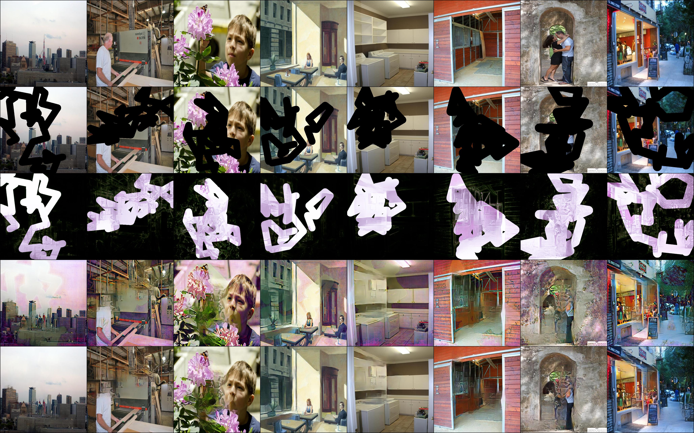

# Inpainting Codebase

This repo implements a simple PyTorch codebase for training inpainting models with powerful tools including Docker, PyTorchLightning, and Hydra.

Currently, only [DFNet](https://github.com/hughplay/DFNet) is supported. More methods as well as some additional useful utilities for image inpainting will be implemented.

## Requirements

- nvidia-docker
- docker-compose

## Features

- PytorchLightning
    - logging (tensorboard, csv)
    - checkpoint
    - DistributedDataParallel
    - mixed-precision
- Hydra
    - flexible configuration system
    - logging (stream to file, folder structure)
- Others
    - save sample results

## Setup

### Build the environment

We use docker to run all experiemnts. Before running any codes, you should check `docker-compose.yml` first. The defualt setting is shown as below:

``` yaml
version: "3.9"
services:
    playground:
        container_name: playground
        build:
            context: docker/
            dockerfile: Dockerfile.local
            args:
                - USER_ID=${UID}
                - GROUP_ID=${GID}
                - USER_NAME=${USER_NAME}
        image: pytorch_local
        environment:
            - TZ=Asia/Shanghai
            - TORCH_HOME=/data/torch_model
        ipc: host
        hostname: docker
        working_dir: /code
        command: ['sleep', 'infinity']
        volumes:
            - .:/code
            - /data1/data:/data
            - /data2/data/train_log/outputs:/outputs
```

You should change the `volumes` to:
- mount your dataset folders to `/data`,
- and mount a folder for `/outputs` (training logs will be written to this folder)

Next, simply run:

```
python core.py env prepare
```

This command will first build an image based on `/docker/Dockerfile.local` and then luanch a container based on this image.


### Enter the environment

Simply run:

```
python core.py env
```

The default user is the same as the host to avoid permission issues. And of course you can enter the container with root:

```
python core.py env --root
```

### Change the environment

Basiclly, there are four config files:

- `/docker/Dockerfile.pytorch` defines basic environments including cuda, cudnn, nccl, conda, torch, etc. This image has been build at [`deepbase/pytorch`](https://hub.docker.com/r/deepbase/pytorch). In general, you don't need to change this.
- `/docker/Dockerfile.local` defines the logic of building the local image. For example, install packages defined in `requirements.txt`.
- `/docker/requirements.txt` defines the python packages you want to install.
- `/docker-compose.yml` defines the setting of running the container. For example, the volumes, timezone, etc.


After changing the settings as you want, you can rebuild the local image by running:


```
python core.py env prepare --build
```


## Training

### Data Prepartion

1. Image data: any image data you like. e.g. Places2, ImageNet, etc.
1. Masks: you can download and use [free-form-mask](download/free-form-mask.tar.gz).

Modify the settings especially the data location under `conf/dataset`.

Tips: your local dataset folder should be mounted to `/data` in docker, remember to change the volumes in `docker-compose.yml`.

### Running

Enter the environment and run:

```
python train.py
```

### Reading Suggestions

Reading the offical documents of Hydra and PyTorchLightning to know more about:
- [Hydra](https://hydra.cc/docs/intro): Very powerful and convenient configuration system and more.
- [PyTorchLightning](https://pytorch-lightning.readthedocs.io/en/latest/starter/new-project.html): You almost only need to write codes for models and data. Say goodbye to codes for pipelines, mixed precision, logging, etc.


## Results

### Results of DFNet

Training on Places2 with 20 epochs.





## License

<a rel="license" href="http://creativecommons.org/licenses/by-nc/4.0/"></a><br />This work is licensed under a <a rel="license" href="http://creativecommons.org/licenses/by-nc/4.0/">Creative Commons Attribution-NonCommercial 4.0 International License</a>.