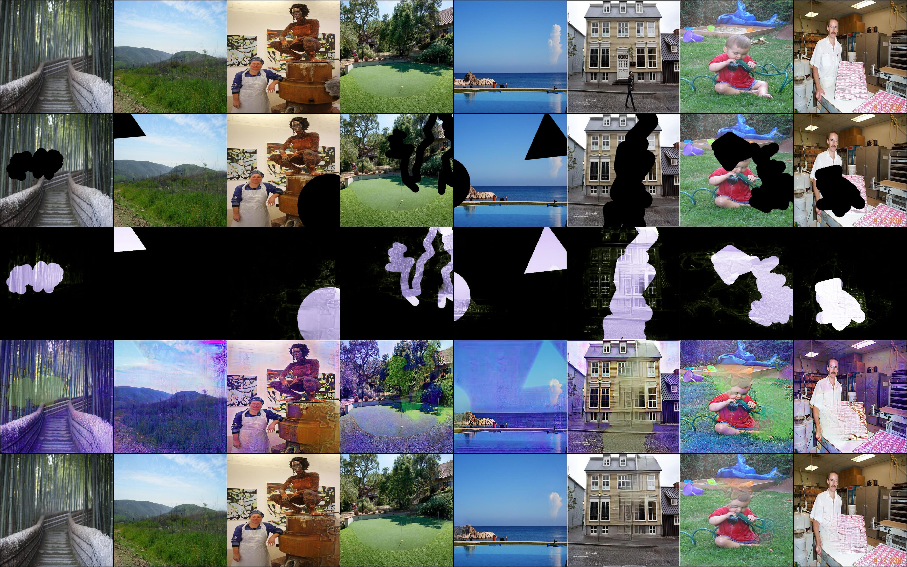

# Inpainting Codebase

This repo implements a simple PyTorch codebase for training inpainting models with powerful tools including Docker, PyTorchLightning, and Hydra.

Currently, only [DFNet](https://github.com/hughplay/DFNet) is supported. More methods as well as some additional useful utilities for image inpainting will be implemented.

## Prerequirements

We use docker to run all experiemnts. 

- [nvidia-docker](https://docs.nvidia.com/datacenter/cloud-native/container-toolkit/install-guide.html)
- [docker-compose](https://docs.docker.com/compose/install/)


## Features

- PytorchLightning
    - logging (tensorboard, csv)
    - checkpoint
    - DistributedDataParallel
    - mixed-precision
- Hydra
    - flexible configuration system
    - logging (stream to file, folder structure)
- Others
    - save sample results

## Setup

### Build the environment

Just run to build the image for the first time:

```
python core.py env prepare
```


Explaination:

- When you first run this command, you will be asked to give three items:
    1. a project name,
    1. the root folder of your train log,
    1. the root folder of your datasets,
- then an image is built based on `/env/Dockerfile`,
- and at last, a container is launched based on `docker-compose.yml`


The defualt setting of `docker-compose.yml` is shown as below:

``` yaml
version: "3.9"
services:
    lab:
        container_name: ${PROJECT}
        runtime: nvidia
        build:
            context: env/
            dockerfile: Dockerfile
            args:
                - USER_ID=${UID}
                - GROUP_ID=${GID}
                - USER_NAME=${USER_NAME}
        image: pytorch181_local
        environment:
            - TZ=Asia/Shanghai
            - TORCH_HOME=/data/torch_model
        ipc: host
        hostname: docker
        working_dir: /code
        command: ['sleep', 'infinity']
        volumes:
            - ${CODE_ROOT}:/code
            - ${DATA_ROOT}:/data
            - ${LOG_ROOT}:/outputs

```

### Enter the environment

Simply run:

```
python core.py env
```

The default user is the same as the host to avoid permission issues. And of course you can enter the container with root:

```
python core.py env --root
```

### Modify the environment at anytime

Basiclly, the environment are determined by four items:

1. `/env/Dockerfile` defines the logic of building the local docker image. For example, installing packages defined in `requirements.txt` based on `deepbase/pytorch:latest`.
1. Base docker image. From `/env/Dockerfile`, you can find [`deepbase/pytorch`](https://hub.docker.com/r/deepbase/pytorch) is the base image. The original Dockerfile of the base image is at [deepcodebase/docker](https://github.com/deepcodebase/docker). You can change the base image as whatever you like.
1. `/env/requirements.txt` defines the python packages you want to install in the local docker image.
1. `/docker-compose.yml` defines the setting of running the container. For example, the volumes, timezone, etc.


After changing the settings as you want at anytime, you can rebuild the local image by running:

```
python core.py env prepare --build
```


## Training

### Data Prepartion

1. Image data: any image data you like. e.g. Places2, ImageNet, etc.
1. Masks: you can download and use [free-form-mask](download/free-form-mask.tar.gz).

Modify the settings especially the data location under `conf/dataset`.

Tips: your local dataset folder should be mounted to `/data` in docker, remember to change the volumes in `docker-compose.yml`.

### Running

After entering the environment, you can launch training. Example training commands:

```
python train.py
python train.py mode=run pl_trainer.gpus=\'3,4\' logging.wandb.notes="tune model"
```

### Reading Suggestions

Reading the offical documents of Hydra and PyTorchLightning to know more about:
- [Hydra](https://hydra.cc/docs/intro): Very powerful and convenient configuration system and more.
- [PyTorchLightning](https://pytorch-lightning.readthedocs.io/en/latest/starter/new-project.html): You almost only need to write codes for models and data. Say goodbye to massive codes for pipelines, mixed precision, logging, etc.


## Results

### Results of DFNet

Training on Places2 with 20 epochs.





## License

<a rel="license" href="http://creativecommons.org/licenses/by-nc/4.0/"></a><br />This work is licensed under a <a rel="license" href="http://creativecommons.org/licenses/by-nc/4.0/">Creative Commons Attribution-NonCommercial 4.0 International License</a>.